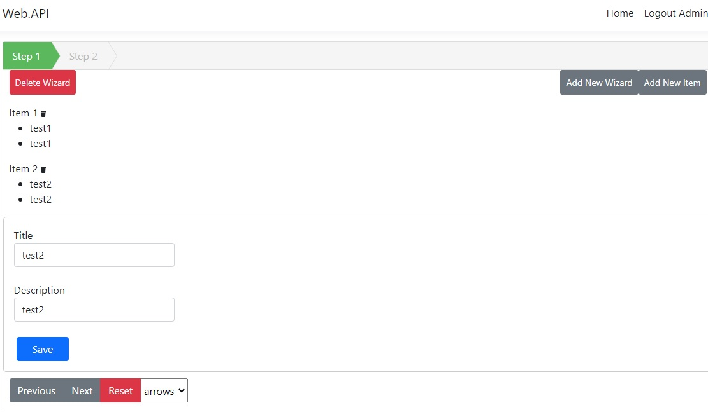

# Al-Ahly-Momken
Simple Task apply crud operaions on a one-many related data you should see something like this
## Wizard and related Items

## 
first you need to get your database so:
using Visual Studio 2019 in package manager console run [update-datbase]
## 
then run your api using[dotnet watch run] or normally from Visual Studio 2019
##
for client side you should run [npm i] to install required libraries
then ng serve to run the client
